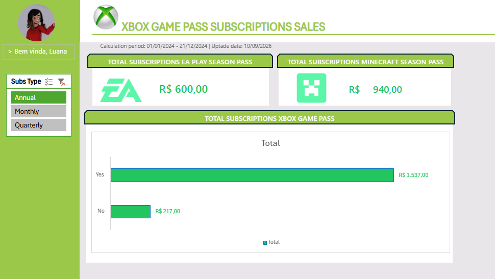

# 🎮 Xbox Game Pass Subscriptions Dashboard

Projeto de visualização e análise de dados focado no mercado de assinaturas do **Xbox Game Pass**, desenvolvido com base na metodologia de arquitetura de dados **ABCDE** para garantir alta performance, organização e escalabilidade em ambientes de planilha.

---

## 📌 Metodologia ABCDE

Para lidar com o volume de dados e manter uma estrutura limpa e profissional, a planilha foi dividida em 5 abas fundamentais:

* **A — Assets (Recursos):** Centralização da identidade visual do projeto, contendo a paleta de cores corporativa, tipografia utilizada, logos da marca e elementos gráficos.
* **B — Bases (Dados Brutos):** Base de dados relacional contendo todo o histórico e volume das transações de assinaturas.
* **C — Cálculos (Processamento):** Camada intermediária com Tabelas Dinâmicas e fórmulas estruturadas para processar os dados brutos e gerar os indicadores do negócio.
* **D — Dashboard (Painel Visual):** Interface final intuitiva voltada para a tomada de decisão estratégica.
* **E — Extras:** Documentações complementares e anotações técnicas do projeto.

---

## 💡 Perguntas de Negócio Respondidas

Na aba de **Cálculos**, estruturamos análises dedicadas para responder a quatro perguntas estratégicas:

1. **Faturamento Total de Planos Anuais:** Consolidação do faturamento bruto considerando todas as assinaturas agregadas.
2. **Faturamento por Auto-Renovação:** Análise comparativa do faturamento de planos anuais dividida entre clientes com renovação automática ativada vs. desativada.
3. **Volume do EA Play:** Totalização exata de vendas e volume de assinaturas do *EA Play*.
4. **Volume do Minecraft Season Pass:** Totalização de assinaturas vendidas para o *Minecraft Season Pass*.

---

## 🖥️ Layout e Recursos do Dashboard

A aba **Dashboard** reúne os principais insights visuais com recursos interativos:

* **Filtro Global:** Segmentação de dados interativa por tipo de assinatura (**Subscription Type**).
* **KPI Cards:** Cards visuais de destaque para acompanhamento rápido de:
* Total Subscriptions EA Play Season Pass
* Total Subscriptions Minecraft Season Pass

* **Visualização Gráfica:** Gráfico de barras detalhando a relação entre o volume **Total de Subscriptions vs. Xbox Game Pass**.

---

## 🖼️ Visualização do Projeto

---

## 🛠️ Tecnologias e Ferramentas Utilizadas

* **Microsoft Excel Online / Google Planilhas:** Tratamento de dados, construção da arquitetura ABCDE e criação de dashboards.
* **Tabelas Dinâmicas & Modelagem:** Estruturação dos dados para performance e resposta das perguntas de negócio.
* **GitHub:** Versionamento e documentação do projeto.

---

## 👤 Autor

Desenvolvido por **Caio Bauab**

* Conecte-se comigo no [LinkedIn](https://www.linkedin.com/in/caio-bauab-032189206/)
* Confira meus projetos no [GitHub](https://github.com/Caiobauab360?tab=repositories)
* Acesse meu [Portfólio Online](https://caiobauab360.github.io/)
